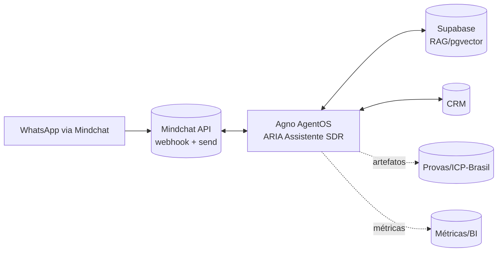
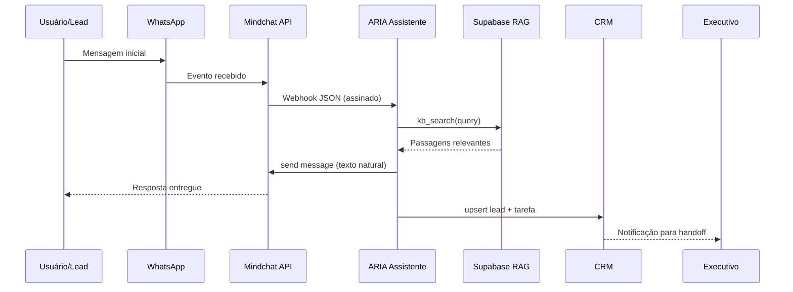

# AR Online — **ARIA SDR via WhatsApp (Mindchat)** com **RAG no Supabase** — v2

> **Escopo**: Documento de referência técnico‑operacional para a **ARIA (Assistente de Relacionamento da AR Online)** com atendimento **primariamente por WhatsApp** através da **API Mindchat**, orquestrado pelo **Agno (AgentOS)** e suportado por **RAG no Supabase (pgvector)**.
>
> **Nota importante de posicionamento**: **AR‑Whatsapp, AR‑Email, AR‑Voz, AR‑SMS e AR‑Cartas** são **CANAIS DE SERVIÇO da AR Online** (envio/entrega/prova). **A ARIA (assistente de atendimento)** deste projeto **atua inicialmente apenas no WhatsApp via Mindchat**; e‑mail/voz/SMS/cartas permanecem como **canais transacionais** opcionais, sem interface conversacional nesta fase.

---

## 1) Visão geral e componentes

### 1.1 Objetivos da ARIA SDR (WhatsApp‑first)

- Capturar **inbound WhatsApp** e qualificar leads através de **conversação natural e fluida**.
- Responder com **conteúdo confiável** usando **RAG (Supabase)** e playbooks aprovados pelo Jurídico (ICP‑Brasil, RN 593, diferenciais).
- Realizar **handoff** ao Executivo com contexto, próximos passos e artefatos.
- **Manter experiência humanizada** em todas as interações.

### 1.2 Arquitetura Macro

- **Canal**: WhatsApp (provedo pela **Mindchat**).
- **Gateway**: **Mindchat API** (webhook de eventos + envio de mensagens).
- **Orquestração**: **Agno AgentOS** (ferramentas, memória de sessão, políticas de roteamento e HITL).
- **Conhecimento**: **Supabase** (Postgres + pgvector) com coleções versionadas de conteúdos AR Online.
- **Backoffice**: CRM (leads/deals/tarefas), módulo de provas (carimbo do tempo ICP‑Brasil), BI/observabilidade.



---

## 2) Requisitos

### 2.1 Funcionais

1. **Webhook Mindchat** recebe mensagens (texto/mídia) e eventos (entrega, erro, typing).
2. **ARIA** processa intenção através de **conversação natural**, obtém contexto via **RAG Supabase**, gera resposta humanizada e chama **cliente Mindchat** para enviar.
3. **Qualificação** (segmento, porte, caso de uso) com campos mínimos para **upsert no CRM**.
4. **Handoff** com resumo estruturado (dor, valor, próximos passos, agenda sugerida).

### 2.2 Não‑funcionais

- P95 **latência de resposta** < **1,5 s** (texto breve, sem mídia pesada).
- **Fluidez máxima** na conversação (sem delays perceptíveis).
- Disponibilidade ≥ **99,5%**; idempotência por `event_id` e `conversationId`.
- **LGPD** e **auditoria** aplicáveis (logs estruturados + OTel tracing).

---

## 3) Integração Mindchat (WhatsApp)

### 3.1 Webhook de entrada

- **Endpoint** público `/webhooks/mindchat` (FastAPI/Flask).
- **Segurança**: verificação de assinatura/HMAC/JWT conforme configuração da Mindchat.
- **Idempotência**: Redis por `event_id`.
- **Normalização**: payload Mindchat → `ARIAMessage` (canônico).

**Modelo de Mensagem**

```json
{
  "event_id": "uuid",
  "timestamp": "2025-10-10T21:05:00Z",
  "conversationId": "abc123",
  "channel": "whatsapp",
  "from": "+5511900000000",
  "type": "text",
  "text": "Preciso de notificação válida juridicamente"
}
```

### 3.2 Envio de mensagens

- Cliente HTTP com **Bearer token** para **/messages** (ajustar ao Swagger Mindchat do ambiente AR Online).
- Persistir `message_id`, status e latência para métricas e DLQ.
- **Garantir fluidez** na entrega das mensagens.

**Exemplo Python (esqueleto)**

```python
import requests
MINDCHAT_BASE = "https://api-aronline.mindchatapp.com.br"
TOKEN = "Bearer <MINDCHAT_API_TOKEN>"

def send_whatsapp_text(to: str, body: str):
    payload = {"to": to, "type": "text", "text": {"body": body}}
    r = requests.post(f"{MINDCHAT_BASE}/v1/messages",
        headers={"Authorization": TOKEN, "Content-Type": "application/json"},
        json=payload, timeout=10)
    r.raise_for_status(); return r.json()
```

---

## 4) Agno (AgentOS) - ARIA

### 4.1 Ferramentas do assistente

- `reply(to, text)`: envia WhatsApp via Mindchat com **tom natural**.
- `kb(query, top_k)`: consulta RAG no Supabase.
- `crm_upsert(lead)`: cria/atualiza lead e tarefas.

**Esboço**

```python
from agno import Agent, tool

@tool
def kb(query: str, top_k: int = 5):
    # chama Supabase (ver §5)
    ...

@tool
def reply(to: str, text: str):
    return send_whatsapp_text(to, text)

aria = Agent(
    name="ARIA-SDR",
    instructions="""
    Você é a ARIA, assistente de relacionamento da AR Online.
    
    CARACTERÍSTICAS:
    - Conversação natural e fluida
    - Tom amigável e profissional
    - Respostas contextualizadas
    - Experiência humanizada
    
    DIRETRIZES:
    - Sempre seja natural e humano
    - Evite linguagem técnica desnecessária
    - Adapte o tom ao contexto da conversa
    - Mantenha consistência na personalidade
    """,
    tools=[kb, reply, crm_upsert]
)
```

### 4.2 Políticas de conversa

- **Abertura** clara e natural: valor + juridicidade (Carimbo do Tempo ICP‑Brasil).
- **Qualificação** em até 5 perguntas curtas e **conversacionais** (segmento, volume, objetivo, sistema atual, urgência).
- **Handoff** quando: intenção `agenda_demo` ou confiança baixa para automação.
- **Fluidez**: Respostas em menos de 1.5s, sem delays perceptíveis.

---

## 5) RAG no Supabase (pgvector)

### 5.1 Estrutura mínima

```sql
create table if not exists kb_chunks (
  id uuid primary key default gen_random_uuid(),
  doc_id uuid not null,
  segment text,
  version text,
  lang text default 'pt-BR',
  content text not null,
  embedding vector(3072)
);
create index on kb_chunks using hnsw (embedding vector_cosine_ops);
```

### 5.2 Função `kb_search`

```sql
create or replace function kb_search(query text, k int default 5)
returns table(content text, score float)
as $$
  select content, 1 - (embedding <=> ai_embed('text-embedding-3-large', query)) as score
  from kb_chunks
  order by embedding <-> ai_embed('text-embedding-3-large', query)
  limit k;
$$ language sql stable;
```

### 5.3 Uso (Python)

```python
from supabase import create_client
from openai import OpenAI

sb = create_client(SUPABASE_URL, SUPABASE_KEY)
openai = OpenAI(api_key=OPENAI_KEY)

def ask_kb(query: str, top_k: int = 5):
    rows = sb.rpc("kb_search", {"query": query, "k": top_k}).execute()
    return "\n\n".join([r["content"] for r in rows.data])
```

---

## 6) Protocolos e formatos

- **TLS 1.2+**, **HSTS**, **Bearer/JWT**; verificação de **HMAC** quando disponível.
- **Identificadores**: `event_id`, `conversationId`, `message_id` para idempotência.
- **Schemas**: JSON Schema versionado para `ARIAMessage`, `ARIALead`, `ARIAHandoff`.

---

## 7) Segurança, LGPD e Conformidade

- **LGPD**: opt‑in explícito (WhatsApp), base legal de contato comercial, retenção mínima necessária, direitos do titular.
- **ICP‑Brasil**: ao promover prova de comunicação, usar **carimbo do tempo** nos eventos relevantes e manter cadeia de validação.
- **DLP**: ofuscar PII em logs; política para anexos/imagens recebidas.
- **Segredos**: rotação de tokens (Mindchat/Supabase/CRM), IP allowlist no webhook.

---

## 8) Desempenho e escalabilidade

- **P95** de **<1,5 s** em respostas de texto; **pooling** de conexões HTTP; **retry com jitter**.
- **Fluidez máxima**: Sem delays perceptíveis na conversação.
- **Autoscaling** do Agno por CPU/QPS; **DLQ** para eventos inválidos.
- **RAG**: índice HNSW bem dimensionado; cache LRU para consultas repetidas.

---

## 9) Observabilidade e testes

- **Métricas**: tempo de 1º contato, taxa de resposta, MQL→SQL, handoff rate, no‑show, **fluidez da conversa**.
- **Logs**: request\_id, conversationId, latências, tool‑calls do Agno.
- **Tracing**: webhook Mindchat → ARIA → Supabase/CRM → resposta.
- **Testes**: unitários (normalização/RAG), integração (Webhook ↔ ARIA ↔ Mindchat), carga (50 msg/s), UAT por segmento.

---

## 10) Fluxo de ponta a ponta



---

## 11) Checklists

**Rollout**

- [ ] Configurar ARIA com personalidade natural
- [ ] Testar fluidez da conversação
- [ ] Validar integração Mindchat
- [ ] Configurar RAG no Supabase
- [ ] Testar handoff para executivos

**Operação diária**

- [ ] Monitorar métricas de fluidez
- [ ] Verificar latência de resposta
- [ ] Analisar satisfação dos usuários
- [ ] Revisar logs de conversação
- [ ] Otimizar respostas baseado no feedback

---

### Anexos

- Comprovante AR Online enviado e aberto.pdf
- Certificado de conclusao - AR Online.pdf
- Relatório Pericial.pdf
- Modelos de Proposta (Mensal/Anual)
