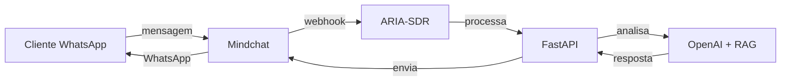

# Integração ARIA-SDR com WhatsApp via Mindchat

## Configuração do Número WhatsApp

### Número Identificado
- **WhatsApp**: BR (16) 99791-8658
- **Status**: Conexão estabelecida ✅
- **Última atualização**: 09/10/25 14:34

## Configuração no ARIA-SDR

### 1. Variáveis de Ambiente

Adicione ao arquivo `.env`:

```bash
# WhatsApp via Mindchat
WHATSAPP_NUMBER=+5516997918658
WHATSAPP_COUNTRY_CODE=BR
WHATSAPP_AREA_CODE=16
WHATSAPP_PHONE=997918658

# Mindchat WhatsApp Integration
MINDCHAT_WHATSAPP_ENABLED=true
MINDCHAT_WHATSAPP_WEBHOOK=https://api-aronline.mindchatapp.com.br/webhook/whatsapp
MINDCHAT_WHATSAPP_TOKEN=c3e79a1e8503825ba091f5e46adeea724131d37f19cc8190c14ba7d6f5efbc7805125dd0bd5d4806be4caee1efe262d42e8b539fad5691d35872a10e1b84e550acc87c1c782461f452d2f72acdbec7204706a402b5963d74d5f6a9b8ae051ac407216f838780e5f937cf6ba745ea893ee4c52557a924ca451e1134af58
```

### 2. Configuração do Agno

Atualize `agno/config/agno-config.json`:

```json
{
  "agno_config": {
    "whatsapp": {
      "enabled": true,
      "number": "+5516997918658",
      "country_code": "BR",
      "area_code": "16",
      "phone": "997918658",
      "webhook_url": "https://api-aronline.mindchatapp.com.br/webhook/whatsapp",
      "mindchat_integration": {
        "api_token": "${MINDCHAT_API_TOKEN}",
        "base_url": "${MINDCHAT_API_BASE_URL}",
        "whatsapp_endpoint": "/api/whatsapp/messages"
      }
    }
  }
}
```

### 3. Endpoints para WhatsApp

Adicione ao `main.py`:

```python
@app.post("/whatsapp/webhook")
def whatsapp_webhook(
    request: Request,
    payload: dict = Body(default_factory=dict),
    _tok: str = Depends(require_auth)
):
    """Webhook para receber mensagens do WhatsApp via Mindchat"""
    
    # Extrair dados da mensagem
    message_data = {
        "from": payload.get("from", ""),
        "to": payload.get("to", ""),
        "message": payload.get("message", ""),
        "timestamp": payload.get("timestamp", ""),
        "message_id": payload.get("id", ""),
        "type": payload.get("type", "text")
    }
    
    # Processar com ARIA
    response = process_aria_message(message_data)
    
    # Enviar resposta via Mindchat
    send_whatsapp_response(response, message_data["from"])
    
    return {"status": "processed", "message_id": message_data["message_id"]}


def process_aria_message(message_data: dict) -> dict:
    """Processa mensagem usando lógica da ARIA"""
    
    # Usar o mesmo endpoint de routing
    routing_payload = {
        "channel": "whatsapp",
        "sender": message_data["from"],
        "user_text": message_data["message"],
        "thread_id": f"wa_{message_data['from']}_{int(time.time())}"
    }
    
    # Chamar endpoint interno
    from fastapi.testclient import TestClient
    client = TestClient(app)
    
    response = client.post(
        "/assist/routing",
        json=routing_payload,
        headers={"Authorization": f"Bearer {API_TOKEN}"}
    )
    
    return response.json()


def send_whatsapp_response(response: dict, to_number: str):
    """Envia resposta via Mindchat WhatsApp API"""
    
    mindchat_payload = {
        "to": to_number,
        "message": response.get("reply_text", "Desculpe, não entendi sua mensagem."),
        "type": "text"
    }
    
    headers = {
        "Authorization": f"Bearer {MINDCHAT_API_TOKEN}",
        "Content-Type": "application/json"
    }
    
    try:
        requests.post(
            f"{MINDCHAT_API_BASE_URL}/api/whatsapp/send",
            json=mindchat_payload,
            headers=headers
        )
    except Exception as e:
        log.error(f"Erro ao enviar WhatsApp: {e}")
```

### 4. Configuração do Docker

Atualize `docker-compose.yml`:

```yaml
environment:
  # ... outras variáveis ...
  - WHATSAPP_NUMBER=+5516997918658
  - WHATSAPP_COUNTRY_CODE=BR
  - WHATSAPP_AREA_CODE=16
  - WHATSAPP_PHONE=997918658
  - MINDCHAT_WHATSAPP_ENABLED=true
  - MINDCHAT_WHATSAPP_WEBHOOK=https://api-aronline.mindchatapp.com.br/webhook/whatsapp
```

### 5. Teste da Integração

```bash
# Testar webhook do WhatsApp
curl -X POST http://localhost:8000/whatsapp/webhook \
  -H "Authorization: Bearer $FASTAPI_BEARER_TOKEN" \
  -H "Content-Type: application/json" \
  -d '{
    "from": "+5516997918658",
    "to": "+5516997918658",
    "message": "Olá ARIA!",
    "timestamp": "2025-10-10T14:34:00Z",
    "id": "msg_123",
    "type": "text"
  }'
```

### 6. Configuração no Mindchat

No dashboard do Mindchat:

1. **Configurar Webhook**:
   - URL: `https://api.ar-online.com.br/whatsapp/webhook`
   - Método: POST
   - Headers: `Authorization: Bearer $FASTAPI_BEARER_TOKEN`

2. **Configurar Número**:
   - Número: +5516997918658
   - Status: Conectado ✅
   - Webhook: Ativo

3. **Testar Conexão**:
   - Enviar mensagem de teste
   - Verificar logs da ARIA
   - Confirmar resposta automática

## Fluxo de Atendimento



## Monitoramento

### Logs Importantes
- Mensagens recebidas via WhatsApp
- Respostas enviadas pela ARIA
- Erros de integração
- Status da conexão

### Métricas
- Volume de mensagens por hora
- Tempo de resposta médio
- Taxa de sucesso das respostas
- Status da conexão WhatsApp

## Troubleshooting

### Problemas Comuns
1. **Webhook não recebe mensagens**
   - Verificar URL do webhook
   - Confirmar autenticação
   - Testar conectividade

2. **Respostas não são enviadas**
   - Verificar token Mindchat
   - Confirmar endpoint de envio
   - Verificar logs de erro

3. **Conexão instável**
   - Monitorar status no dashboard
   - Verificar configurações de rede
   - Reiniciar conexão se necessário

## Próximos Passos

1. **Configurar webhook** no Mindchat
2. **Testar integração** com mensagens reais
3. **Monitorar logs** e métricas
4. **Ajustar configurações** conforme necessário
5. **Implementar fallbacks** para casos de erro
